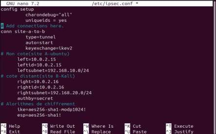
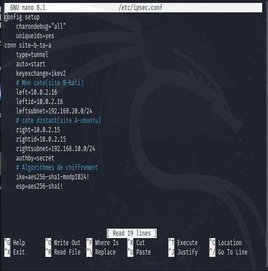
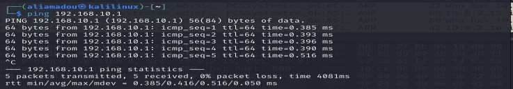
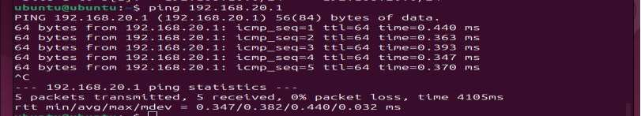
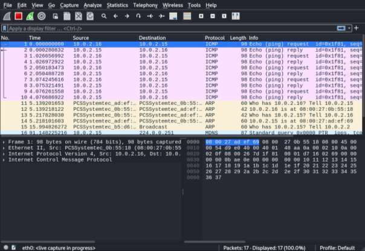
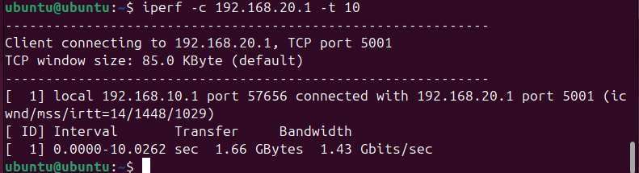
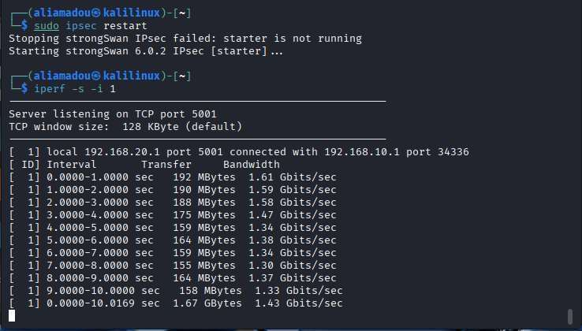

# 🔒 Site-to-Site IPsec VPN with StrongSwan


A hands-on lab implementing a site-to-site IPsec VPN tunnel between two simulated remote networks, with traffic analysis proving confidentiality gains and a measured performance trade-off.

---

## 🎯 Objective

Secure communication between two private networks over an untrusted link using IPsec in tunnel mode, then validate the security and performance impact empirically rather than just in theory:

- Configure a site-to-site IPsec VPN tunnel between two remote networks
- Compare encrypted vs. unencrypted traffic with Wireshark
- Measure the throughput cost of cryptographic processing with iperf

---

## 🛠️ Tech Stack

| Component | Choice |
|---|---|
| IPsec implementation | StrongSwan |
| Key exchange | IKEv2 |
| Security protocol | ESP (Encapsulating Security Payload) |
| Mode | Tunnel mode |
| Authentication | Pre-Shared Key (PSK) |
| Encryption | AES-256 |
| Integrity | SHA-1 |
| DH Group | MODP1024 |
| Site A | Ubuntu Linux |
| Site B | Kali Linux |
| Traffic analysis | Wireshark |
| Performance testing | iperf |

---

## 🏗️ Network Topology

```
        Site A (Ubuntu)                         Site B (Kali)
   Internal: 192.168.10.0/24              Internal: 192.168.20.0/24
   NAT IP:   10.0.2.15                    NAT IP:   10.0.2.16
        │                                            │
        └──────────── IPsec Tunnel (ESP) ───────────┘
              Encrypted over the "untrusted" NAT network
```

Each VM was configured with two interfaces (NAT + internal) to simulate two physically separate sites communicating over an untrusted network, which is the standard site-to-site VPN scenario.

---

## ⚙️ Configuration

**Site A — `/etc/ipsec.conf`**
```
config setup
    charondebug="all"
    uniqueids=yes

conn site-a-to-b
    type=tunnel
    auto=start
    keyexchange=ikev2

    # My side (Site A - Ubuntu)
    left=10.0.2.15
    leftid=10.0.2.15
    leftsubnet=192.168.10.0/24

    # Remote side (Site B - Kali)
    right=10.0.2.16
    rightid=10.0.2.16
    rightsubnet=192.168.20.0/24

    authby=secret

    # Cipher suites
    ike=aes256-sha1-modp1024!
    esp=aes256-sha1!
```

**Site B — `/etc/ipsec.conf`** (mirrored, `left`/`right` swapped)
```
conn site-b-to-a
    type=tunnel
    auto=start
    keyexchange=ikev2
    left=10.0.2.16
    leftid=10.0.2.16
    leftsubnet=192.168.20.0/24
    right=10.0.2.15
    rightid=10.0.2.15
    rightsubnet=192.168.10.0/24
    authby=secret
    ike=aes256-sha1-modp1024!
    esp=aes256-sha1!
```

**`/etc/ipsec.secrets`** (identical on both sites)
```
10.0.2.16 10.0.2.15 : PSK "CHANGE_ME_BEFORE_PUSHING"
10.0.2.15 10.0.2.16 : PSK "CHANGE_ME_BEFORE_PUSHING"
```

> ⚠️ The PSK above is the lab value — never reuse a shared secret like this in any real deployment. Use a long random key or switch to certificate-based authentication for production.

<p align="center">
  
  
</p>
<p align="center"><em>ipsec.conf on Site A (left) and Site B (right) — mirrored connection definitions</em></p>

---

## ✅ Validation

**1. Connectivity across the tunnel** — pinging across the internal subnets confirms the tunnel routes traffic correctly between sites that have no direct route to each other otherwise:

```
ping 192.168.20.1   # from Site A
ping 192.168.10.1   # from Site B
```
Both succeeded with 0% packet loss.

**2. Tunnel established over the NAT (public-facing) interface** — pinging the NAT IPs directly also confirmed reachability before validating the tunnel itself.

<p align="center">
  
  
</p>
<p align="center"><em>Successful ping across the tunnel between internal subnets (192.168.10.0/24 ↔ 192.168.20.0/24), 0% packet loss</em></p>

---

## 🔍 Security Analysis — Wireshark

Traffic was captured on the NAT interface to compare plaintext vs. encrypted behavior:

- **Without IPsec:** ICMP echo request/reply packets were fully readable in plaintext
- **With IPsec enabled:** the same traffic appeared as encrypted ESP packets — payload, including the original ICMP data, was no longer visible to a passive observer on the link

This directly demonstrates IPsec ESP's confidentiality guarantee: anyone capturing traffic on the link between the two sites sees only encrypted ESP packets, not the underlying ICMP/application data.

<p align="center">
  
</p>
<p align="center"><em>Wireshark capture without IPsec: ICMP echo request/reply packets fully visible in plaintext on the NAT interface</em></p>

---

## 📊 Performance Analysis — iperf

| Condition | Throughput |
|---|---|
| Without IPsec | ~1.66 GB / 10s (~1.43 Gbits/sec sustained, before tunnel) |
| With IPsec (ESP, AES-256) | ~1.67 GB / 10s (~1.43 Gbits/sec sustained, encrypted) |

Per-second bandwidth samples under IPsec showed a dip mid-transfer (down to ~1.12–1.20 Gbits/sec) before recovering, consistent with the cryptographic processing overhead from AES-256 encryption and SHA-1 integrity checks on every packet. This is the expected security/performance trade-off: the tunnel adds CPU cost per packet in exchange for confidentiality and integrity guarantees.

<p align="center">
  
  
</p>
<p align="center"><em>iperf throughput without IPsec (left) vs. with IPsec enabled (right) — visible bandwidth dip under encryption</em></p>

---

## 💡 Key Takeaways

- **Tunnel mode vs. transport mode matters**: tunnel mode encrypts the entire original IP packet and wraps it in a new one, which is why this setup works for two private subnets that don't have public IPs reachable directly — transport mode would only protect the payload, not enable the site-to-site routing
- **IKEv2 negotiation happens before any data moves**: the SAs (Security Associations) must be established first, which is why `ipsec restart` was sometimes needed when testing — a stale or non-running charon daemon means no SA, no tunnel
- **PSK authentication is the simplest IKE auth method but the weakest for production**: it works well for a lab, but RSA/certificate-based auth scales much better and avoids shared-secret distribution problems in real deployments
- **The performance cost is real but usually acceptable**: modern AES-NI hardware acceleration makes the overhead seen here (encryption + SHA-1 per packet) much smaller in production hardware than on a VM running inside VirtualBox

---

## ▶️ Reproduce This Lab

```bash
# On both VMs
sudo apt update
sudo apt install strongswan iperf

# Enable IP forwarding
sudo sysctl -w net.ipv4.ip_forward=1

# Edit /etc/ipsec.conf and /etc/ipsec.secrets as shown above (mirrored per site)

# Restart and check status
sudo ipsec restart
sudo ipsec status

# Validate
ping <remote internal IP>

# Capture traffic to compare plaintext vs ESP
sudo wireshark -i <nat-interface>

# Measure throughput
iperf -s -i 1          # on one VM (server)
iperf -c <remote-ip> -t 10   # on the other (client)
```

---

## 📚 References

- [StrongSwan Documentation](https://docs.strongswan.org/)
- [RFC 4301 — Security Architecture for IP](https://www.rfc-editor.org/rfc/rfc4301)
- [RFC 7296 — IKEv2](https://www.rfc-editor.org/rfc/rfc7296)
